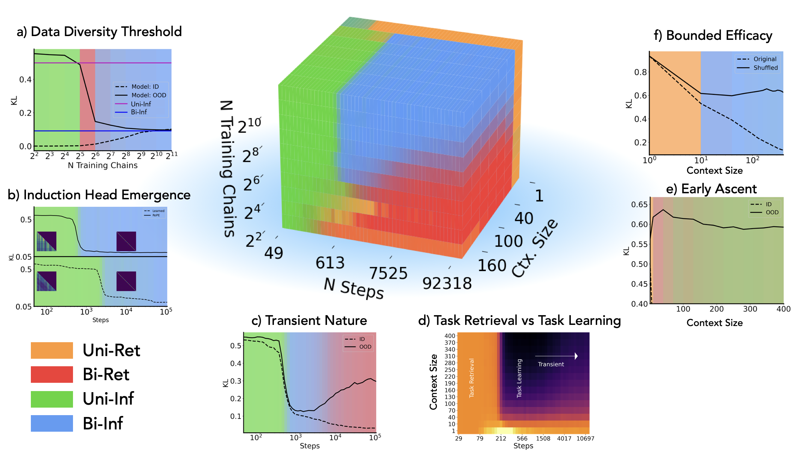

# Competition Dynamics Shape Algorithmic Phases of In-Context Learning

#### Core Francisco Park$^*$, Ekdeep Singh Lubana$^*$, Itamar Pres, Hidenori Tanaka$^\dagger$

Arxiv Preprint: [https://arxiv.org/abs/2412.01003](https://arxiv.org/abs/2412.01003)

